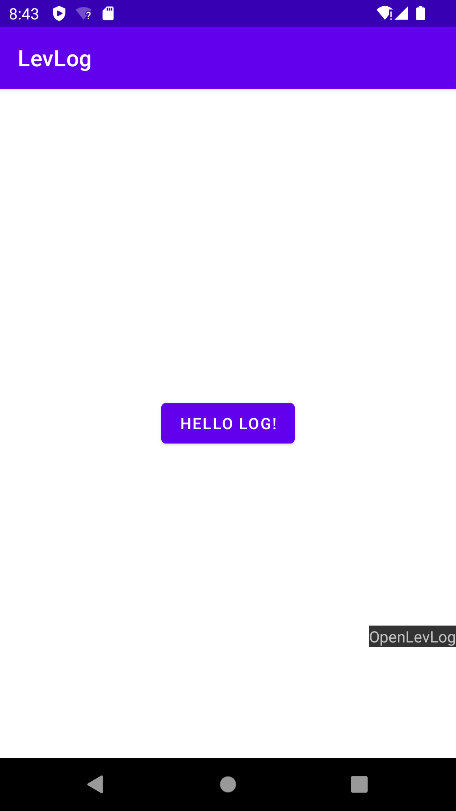

# LevLog
轻量级Log日志SDK，支持悬浮窗展示，Log日志不同级别信息根据颜色进行区分

---
##  1.未打开Log日志悬浮窗，按钮文案为：OpenLevLog
 

##  2.打开Log日志悬浮窗，按钮文案变为：CloseLevLog
##    log日志不同级别信息根据颜色进行区分，可在悬浮窗滚动查看
 

####  根目录下build.gradle配置:
Add it in your root build.gradle at the end of repositories:

	allprojects {
		repositories {
			...
			maven { url 'https://www.jitpack.io' }
		}
	}
 
#### App目录下build.gradle配置:
Step 2. Add the dependency

	dependencies {
	        implementation 'com.github.libraMR:LevLog:-SNAPSHOT'
	}
---
