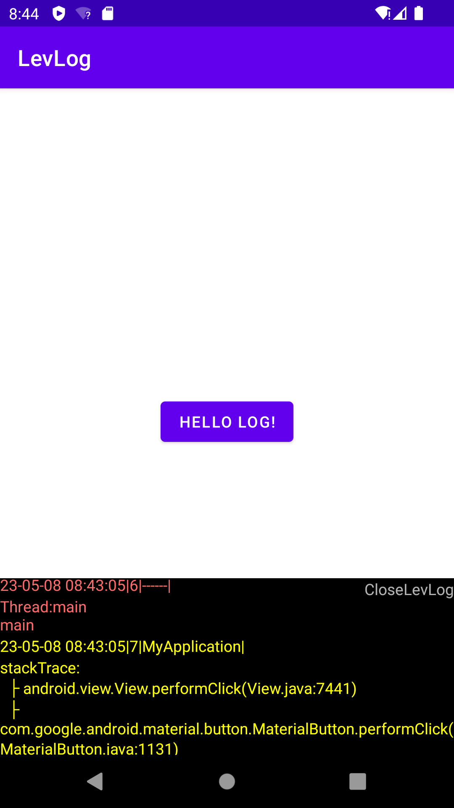

# LevLog
轻量级log日志系统，支持悬浮窗展示，log日志级别颜色区分

 

####  根目录下build.gradle配置:
Add it in your root build.gradle at the end of repositories:

	allprojects {
		repositories {
			...
			maven { url 'https://www.jitpack.io' }
		}
	}
 
#### App目录下build.gradle配置:
Step 2. Add the dependency

	dependencies {
	        implementation 'com.github.libraMR:LevLog:-SNAPSHOT'
	}
---
